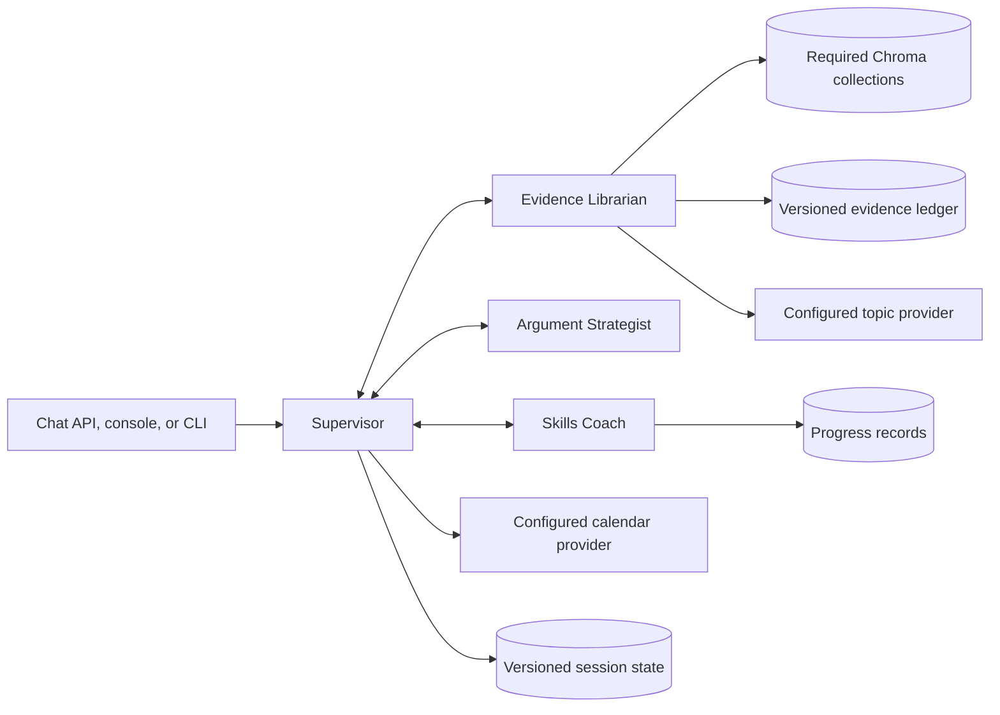

# CaseFile

CaseFile is a citation-preserving Public Forum evidence and coaching system built around one
LangGraph runtime and four agents:

- **Supervisor** owns the conversation, delegates bounded work, manages clarification and
  confirmation, and is the only agent allowed to schedule coaching sessions.
- **Evidence Librarian** retrieves confirmed evidence and rules, reads explicitly configured
  topic providers, and manages confirmation-gated DOCX ingestion.
- **Argument Strategist** creates and revises structured arguments from an `EvidencePacket`.
- **Skills Coach** creates drills, runs labeled simulated coaching turns, summarizes progress,
  and proposes coach-authored assessments.

Every model, tool, artifact, session, trace, and API boundary is typed. Model, retrieval,
provider, and validation failures stop the request and return a stable error code; CaseFile does
not manufacture a substitute result.

## Architecture



The compiled graph in `casefile/agents/graph.py` is the only production orchestration path.
Requests always begin with deterministic security screening and then reach the model-driven
Supervisor. Specialist work returns to the Supervisor before the graph finishes or requests
more input.

Detailed Mermaid sources are in [`docs/workflow-diagrams`](docs/workflow-diagrams/README.md).

## Requirements

- Python 3.11 or newer
- An Anthropic-compatible API key and model endpoint
- LangGraph
- Chroma
- The pinned `sentence-transformers/all-MiniLM-L6-v2` assets available locally

Install the application and development dependencies:

```bash
python -m pip install -e '.[dev]'
```

Provision the pinned embedding model once:

```bash
python - <<'PY'
from sentence_transformers import SentenceTransformer

model = SentenceTransformer("sentence-transformers/all-MiniLM-L6-v2")
model.save("casefile/embedding_models/all-MiniLM-L6-v2")
PY
```

Copy the environment template and supply a real model key:

```bash
cp .env.example .env
export ANTHROPIC_API_KEY='replace-with-a-real-key'
```

CaseFile does not load `.env` automatically. Export the values in your shell or use your
process manager's environment configuration.

## Configuration

Core runtime values:

| Variable | Purpose |
| --- | --- |
| `ANTHROPIC_API_KEY` | Required model credential |
| `ANTHROPIC_BASE_URL` | Anthropic-compatible API origin |
| `CASEFILE_MODEL` | Required model identifier |
| `CASEFILE_EMBEDDING_MODEL_PATH` | Local pinned embedding assets |
| `CASEFILE_DATA_DIR` | Ledgers, sessions, audits, and pending writes |
| `CASEFILE_CHROMA_DIR` | Required persistent Chroma store |
| `CASEFILE_INGEST_ROOTS` | Explicit filesystem roots allowed for ingestion |
| `CASEFILE_EXPOSE_MODEL_PROMPTS` | Include full prompts/responses in local developer traces |

Optional providers are disabled unless selected explicitly:

| Variable | Accepted values | Related configuration |
| --- | --- | --- |
| `CASEFILE_CALENDAR_PROVIDER` | `disabled`, `fixture`, `google` | Google requires the `calendar` extra and `GOOGLE_CALENDAR_CREDENTIALS`; fixture writes are synthetic |
| `CASEFILE_NSDA_PROVIDER` | `disabled`, `fixture`, `http` | HTTP requires `NSDA_BASE_URL`; fixture uses `CASEFILE_NSDA_FIXTURE_PATH` |

Selecting `google` without its dependency or credentials, `http` without a base URL, an unknown
provider value, or a missing fixture file is a configuration error. Install Google support with
`python -m pip install -e '.[calendar]'`. A disabled capability returns `CAPABILITY_DISABLED`
when requested.

For a fully local provider demonstration, opt in explicitly:

```bash
export CASEFILE_CALENDAR_PROVIDER=fixture
export CASEFILE_NSDA_PROVIDER=fixture
```

The fixture data is synthetic and labeled as such in every returned artifact.

## Run

Start the API and browser console:

```bash
uvicorn casefile.api.main:app --reload
```

Open <http://127.0.0.1:8000>. Readiness endpoints are:

- `GET /health/live` — the process is serving requests.
- `GET /health/ready` — validates graph/model startup and Chroma readiness, then reports storage
  and the explicitly selected providers. Dependency failures use the typed error envelope.

Run one CLI conversation:

```bash
casefile --role student --user-id student-1 \
  --resolution 2026-09-CRYPTO \
  'Research confirmed Pro evidence about consumer protections.'
```

With no message argument, `casefile` starts an interactive session.

## Chat API

Both transports enter the same four-agent runtime:

- `POST /chat` accepts JSON.
- `POST /chat/with-attachment` accepts multipart form data with one DOCX attachment.

Example:

```bash
curl -sS http://127.0.0.1:8000/chat \
  -H 'content-type: application/json' \
  -H 'x-request-id: demo-research-1' \
  -d '{
    "message": "Research confirmed Pro evidence about consumer protections.",
    "role": "student",
    "user_id": "student-1",
    "resolution": "2026-09-CRYPTO"
  }'
```

A successful chat response contains:

- `status`, `response`, `request_id`, and `session_id`
- `active_agent` and `active_goal`
- distinct `awaiting_input` and `awaiting_confirmation` flags
- typed `artifacts`
- ordered `agent_trace`, `tool_trace`, and `model_trace`

Artifacts are discriminated by `artifact_type`: `evidence_packet`, `rule_packet`,
`topic_packet`, `ingestion_preview`, `ingestion_commit_result`, `argument_draft`,
`drill_plan`, `coach_turn`, `progress_summary`, `assessment_proposal`, or `calendar_event`.

Failures are never returned as HTTP 200 prose:

```json
{
  "status": "failed",
  "request_id": "demo-research-1",
  "session_id": null,
  "error": {
    "code": "AUTHORIZATION_DENIED",
    "message": "Students may read only their own progress.",
    "stage": "tools.get_progress",
    "agent": "skills_coach",
    "tool": "get_progress",
    "retryable": false,
    "details": {}
  },
  "agent_trace": [],
  "tool_trace": [],
  "model_trace": []
}
```

## Explicit integration endpoints

Only operations that benefit from non-chat integrations have separate mutation endpoints:

- `POST /ingestion/confirm`
- `POST /ingestion/quarantine/approve` — coach role required
- `POST /calendar/session/confirm`

The configured NSDA-compatible read API is exposed under `/nsda/v1`. It returns 503 while the
capability is disabled and uses only the provider selected by `CASEFILE_NSDA_PROVIDER`.

## Evidence ingestion

DOCX ingestion is a two-step operation:

1. Send the document through `/chat/with-attachment`. The Supervisor delegates to the Evidence
   Librarian, which performs safe OOXML extraction, model boundary detection, model labeling,
   deterministic validation, and source screening.
2. Review the complete `IngestionPreview`, including full bodies, citations, marked spans,
   provenance, flags, and exclusion reasons. Commit its token through the session composer or
   `POST /ingestion/confirm`.

The commit verifies the source hash, writes the versioned ledger atomically, rebuilds the
required Chroma collection, retires the confirmation token, and removes staged uploads.
Pending or quarantined cards are never searchable.

The direct ingestion command uses the same pipeline:

```bash
casefile-ingest background/cards.docx \
  --resolution 2026-09-CRYPTO \
  --side pro \
  --json
```

Use the returned token with `casefile-ingest --confirm TOKEN --json`.

## Security and integrity

- Security screening runs before model routing and before every sensitive write.
- Tools independently enforce role, ownership, and allowed-agent policy.
- Assessment, ingestion, quarantine approval, and real calendar operations are confirmation or
  role gated and idempotent.
- Source text, citations, card IDs, hashes, paragraph assignments, and marked spans are preserved.
- Only confirmed, indexable cards enter Chroma retrieval.
- Argument citations must be an exact subset of the returned `EvidencePacket`; unsupported
  sections cannot cite cards.
- Simulated coaching is labeled and never writes progress automatically.
- Audit records redact credentials and high-risk free text.

## MCP

Install the optional MCP dependency and run the stdio server:

```bash
python -m pip install -e '.[mcp]'
python -m casefile.mcp.server
```

The MCP surface exposes focused read operations and the typed Skills Coach/Librarian handoff.
It uses the same tool registry, ownership checks, retrieval backend, and rate limits as the
application.

## Tests and retrieval evaluation

Run the current test suite:

```bash
pytest -q
```

Run static checks:

```bash
ruff check casefile tests
ruff format --check casefile tests
```

Evaluate the required Chroma ranking path:

```bash
casefile-retrieval-eval --card-text stored --k 3 --min-relevance 0.08
```

The retrieval evaluation uses curated relevant IDs, resolution/side filters, empty-result cases,
and reports recall, precision, MRR, hit rate, filter leakage, and latency.

## Repository layout

```text
casefile/
  agents/       typed contracts, four agents, LangGraph, prompts, sessions, errors
  api/          FastAPI contracts, error mapping, and typed browser console
  tools/        registered agent-scoped tools and authorization/storage boundaries
  ingest/       lossless OOXML extraction, model passes, validation, staging, commit
  providers/    explicitly selected NSDA fixture and HTTP implementations
  security/     request/document screening and audit redaction
  evals/        required Chroma retrieval evaluation
  mcp/          optional stdio integration
docs/
  DEMO_SCRIPT.md
  workflow-diagrams/
```
