# CaseFile agent workflows

These diagrams describe the code that runs today. They distinguish the agent's
LangGraph orchestration from direct API ingestion endpoints and direct MCP tool calls.
When LangGraph is not installed, `CaseFileAgent` executes the same nodes in the same order
with its sequential fallback.

## 1. Shared request lifecycle

Every `/chat` request goes through this graph before a domain tool is called.

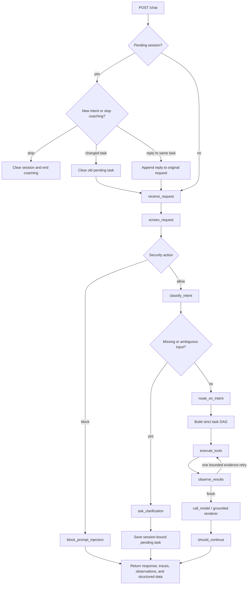

The security decision is deterministic. The optional model classifier is used only when
the deterministic classifier still has a general, read-only ambiguity; it cannot create a
write intent or override a block. Clarifications are limited to six turns and are bound to
the original user and resolution.

## 2. Find evidence and format an argument

Intent: `retrieve_evidence`  
Task action: `search_cards`

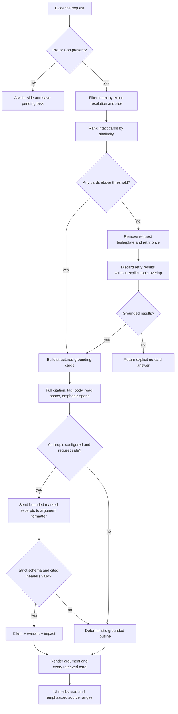

The model receives only bounded source excerpts and card metadata. It may organize those
sources into an argument, but it cannot repair evidence, invent a citation, or add outside
facts. Citation headers in its structured output must be a subset of the retrieved cards.
The browser renders the full original card bodies separately from generated analysis.

## 3. Explain a rule

Intent: `explain_rule`  
Task action: `search_rules`

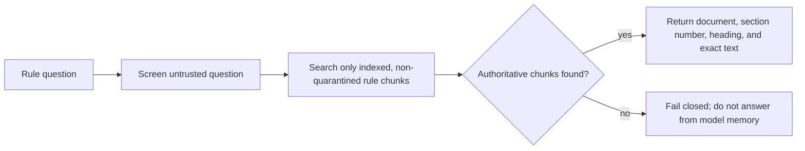

There is currently no bundled authoritative rules corpus, so the normal result is the
fail-closed response until approved rule documents are indexed.

## 4. Generate a drill

Intent: `generate_drill`  
Task action: `generate_drill`

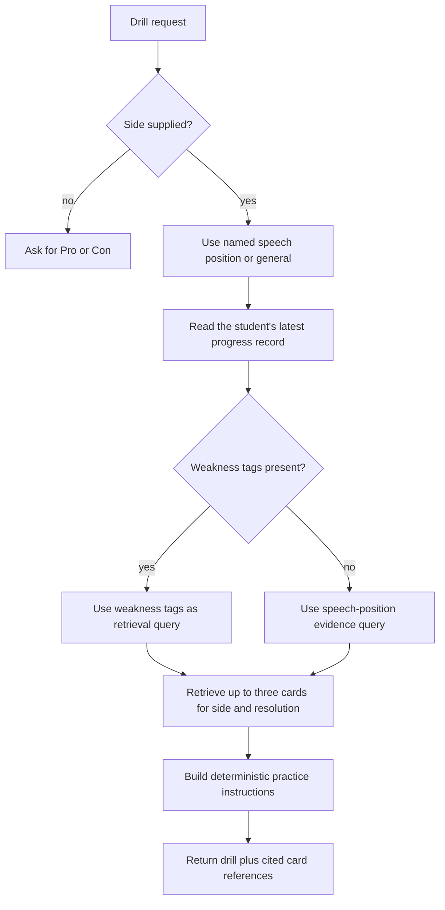

Drill creation does not generate a competition speech. It creates a practice task that
requires the student to supply the debating.

## 5. Simulated coach

Intent: `coach_simulation`  
Task action: `coach_simulation`

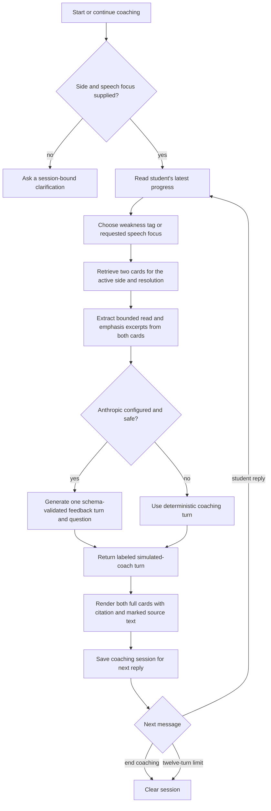

The coach is an agent behavior inside the student's session, not a second frontend persona.
It receives bounded marked excerpts from both retrieved cards, asks one question at a time,
and never writes the student's speech.

## 6. Check progress

Intent: `progress`  
Task action: `progress`

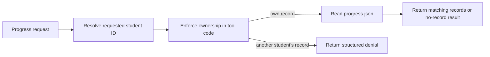

The current browser uses one student identity. A legacy trusted `coach` caller can write an
assessment through the internal tool/API path, but that is not a separate browser persona
and is not exposed over MCP.

## 7. Attach and ingest evidence

The browser attachment workflow begins with the agent for request screening and intent
routing, then uses the ingestion service directly for the file lifecycle.

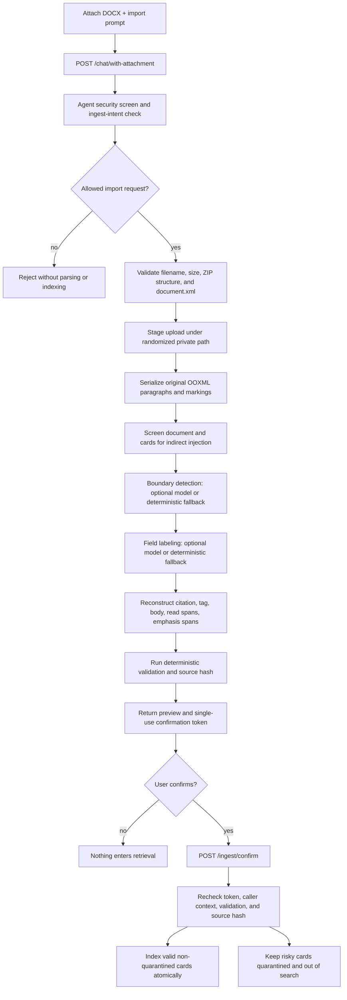

The original text is the source of truth. Model passes return indices or labels only; they
do not rewrite the document. The preview/confirm gate is why attaching a file does not
immediately modify the evidence index.

## 8. Schedule a session

Intent: `schedule_session`  
Task action: `schedule_session`

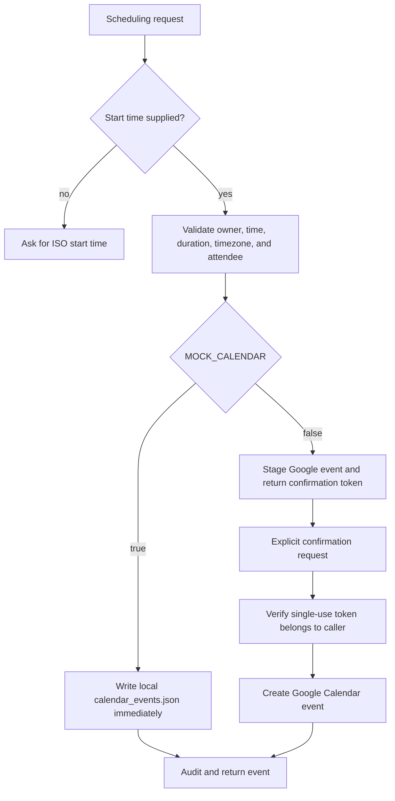

The mock is a local integration substitute for demos; it does not contact a calendar
provider. Real Google Calendar writes require the extra confirmation turn.

## 9. Compound requests and replanning

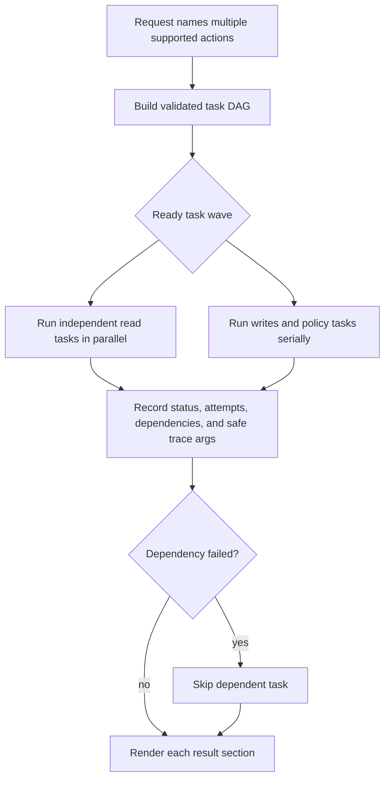

Read tasks may retry transient failures within their task limit. Write and policy tasks get
one attempt. When assessment logging and scheduling appear together, scheduling depends on
the assessment result.

## 10. External MCP workflow

MCP is a direct tool surface, not a remote entry point into the complete chat graph.

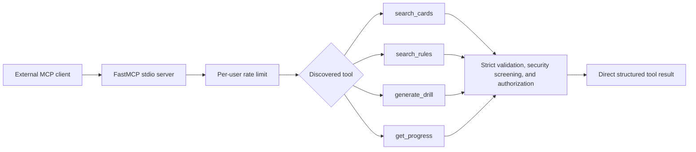

Because MCP calls tools directly, they do not use chat intent classification, clarification
sessions, the empty-search replan, simulated coaching, or the AI argument formatter.
Ingestion, quarantine approval, assessment writes, and calendar writes remain internal.

## 11. Synthetic NSDA provider

The NSDA integration is a read-only provider boundary for development and demos. The
bundled data is fictional and does not enter the authoritative rules index.

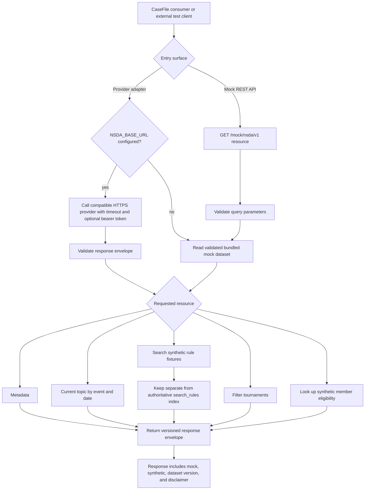

The HTTP adapter requires HTTPS except for loopback development and rejects base URLs with
embedded credentials, query strings, or fragments. Mock rules are never promoted into the
authoritative `search_rules` corpus, which continues to fail closed until approved source
documents are indexed.
